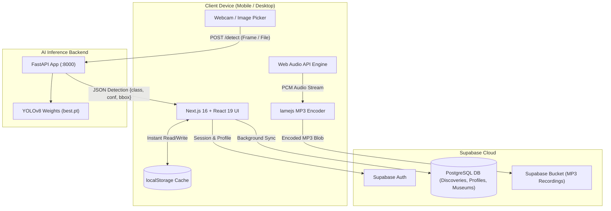

# 🏛️ IKIGAI — Museum Melody
### *Don't just look at history. Find it, hear it, and play it.*

[](https://nextjs.org/)
[](https://react.dev/)
[](https://fastapi.tiangolo.com/)
[](https://docs.ultralytics.com/)
[](https://supabase.com/)
[](https://developer.mozilla.org/en-US/docs/Web/API/Web_Audio_API)
[](https://www.typescriptlang.org/)

---

## 🌟 Executive Summary

**IKIGAI: Museum Melody** is an intelligent, interactive mobile-first web platform that transforms physical museum visits into an engaging musical treasure hunt. Designed around Maharashtra’s world-renowned cultural repositories (such as the **Raja Dinkar Kelkar Museum** in Pune and **CSMVS** in Mumbai), the platform bridges physical artifacts with digital discovery.

Rather than reading dry informational placards, visitors point their smartphone camera at historical instruments, sculptures, and paintings. Powered by a fine-tuned **YOLO Computer Vision model**, Museum Melody instantly identifies the artifact, unlocks its historical narrative, lets visitors **hear authentic ragas**, **play the instrument live** through interactive web-synthesizers, **record and export custom performances as MP3**, and build their personal **archival discovery collection**.

---

## 🎯 The Core Experience: The Canonical Loop

```
 ┌─────────────────┐       ┌─────────────────┐       ┌─────────────────┐
 │   1. EXPLORE    │ ────> │  2. SCAN/UPLOAD │ ────> │ 3. AI DETECTION │
 │ Museum Galleries│       │ Live Camera/File│       │ YOLOv8 Engine   │
 └─────────────────┘       └─────────────────┘       └────────┬────────┘
                                                              │
 ┌─────────────────┐       ┌─────────────────┐       ┌────────▼────────┐
 │   6. RECORD     │ <──── │   5. PLAY LIVE  │ <──── │   4. DISCOVER   │
 │ In-browser MP3  │       │ Web Audio Synth │       │ Cultural Lore   │
 └────────┬────────┘       └─────────────────┘       └─────────────────┘
          │
 ┌────────▼────────┐       ┌─────────────────┐       ┌─────────────────┐
 │   7. COLLECT    │ ────> │   8. SHOWCASE   │ ────> │   9. REPEAT     │
 │ Persistent Sync │       │ Personal Archive│       │ Next Discovery  │
 └─────────────────┘       └─────────────────┘       └─────────────────┘
```

---

## ✨ Key Innovations & Features

### 1. 👁️ Real-Time Computer Vision & Visual Search
- **Dual-Mode Recognition**: Seamlessly switch between a **live webcam/camera scanner** with targeting reticles or **image file upload** for instant artifact analysis.
- **Fine-Tuned YOLOv8 Pipeline**: High-speed inference recognizing 10+ classical and traditional Indian instruments with confidence scoring and bounding boxes.
- **Smart Fallback Engine**: Curated sample library and manual instrument switcher ensuring zero dead-ends during museum tours.

### 2. 🎵 Interactive Web Audio Synthesis & Virtual Instruments
- **Instant Playability**: Every discovered instrument features a dedicated virtual play surface (piano keys, string plucks, tabla strokes) powered by the **Web Audio API**.
- **Authentic Microtonal Tuning**: Synthesizers configured with harmonic overtones and traditional Indian classical scales (Bhairav, Yaman, Kafi).
- **Physical Feel**: Real-time canvas waveform visualizations and touch-responsive micro-animations.

### 3. 🎙️ Live Performance Recording & In-Browser MP3 Encoder
- **Zero-Latency In-Browser Capture**: Records live user performances without requiring server-side audio processing.
- **Client-Side MP3 Encoding**: Integrates `lamejs` to encode raw PCM audio directly to standard `.mp3` format on the fly.
- **Cloud & Local Archiving**: Instantly download `.mp3` files locally or sync them to Supabase Storage and link to user profiles.

### 4. 🏛️ Immersive 3D Gallery Exploration & Museum Flow
- **Interactive 3D Coverflow**: Smooth, perspective-scaled carousel showcasing pilot museums across Maharashtra.
- **Exhibit Progress Tracking**: Real-time counters showing discovered vs. locked instruments per museum.
- **Resilient Dual-Sync Architecture**: `localStorage` instant caching combined with asynchronous Supabase Postgres background sync ensures visitors never lose progress, even with spotty museum Wi-Fi.

### 5. 👤 Visitor Cultural Archive & Profile
- **Personal Collection Vault**: Review all unlocked instruments, read historical narratives, and re-listen to instrument samples.
- **Recording Studio Archive**: Replay previously recorded tracks directly in the browser with custom audio playback controls.

---

## 🪕 Supported Instruments Catalogue

| Instrument | Traditional Category | Cultural Origin | Audio Mode |
|---|---|---|---|
| **Sitar** (*सितार*) | *Tata Vadya* (Chordophone) | Classical Hindustani / Medieval Courts | Plucked String Synthesizer |
| **Tabla** (*तबला*) | *Avanaddha Vadya* (Membranophone) | Classical Rhythm & Accompaniment | Resonant Percussive Hits (Bayan & Dayan) |
| **Bansuri** (*बांसुरी*) | *Sushira Vadya* (Aerophone) | Folk & Classical Vedic Flute | Pure Sine Wind Harmonics |
| **Harmonium** (*हार्मोनियम*) | *Free-Reed Aerophone* | Maharashtra Natya Sangeet & Bhajans | Multi-reed Polyphonic Chords |
| **Sarangi** (*सारंगी*) | *Tata Vadya* (Bowed Lute) | Indian Classical Vocal Emulation | Continuous Bowed Sawtooth Wave |
| **Santoor** (*संतूर*) | *Tata Vadya* (Hammered Dulcimer) | Kashmiri Folk / Sufiana Kalam | Multi-string Bell-like Resonance |
| **Shehnai** (*शहनाई*) | *Sushira Vadya* (Double-Reed) | Auspicious Ceremonies & Temples | Expressive Reedy Vibrato |
| **Tanpura** (*तानपुरा*) | *Tata Vadya* (Drone Chordophone) | Raga Foundation & Swara Anchor | 4-String Continuous Drone Loop |
| **Pakhawaz** (*पखावज*) | *Avanaddha Vadya* (Barrel Drum) | Ancient Dhrupad & Haveli Sangeet | Deep Low-End Double-headed Percussion |
| **Sarod** (*सरोद*) | *Tata Vadya* (Fretless Lute) | Royal Court Darbars / Senia Gharana | Fretless Metallic Glide & Pluck |

---

## 🏗️ System Architecture



---

## 💻 Tech Stack

### Frontend & Client
- **Framework**: [Next.js 16.3.5](https://nextjs.org/) (App Router, Turbopack ready)
- **Library**: [React 19.2.8](https://react.dev/)
- **Language**: [TypeScript 5](https://www.typescriptlang.org/)
- **Styling**: [Tailwind CSS v4](https://tailwindcss.com/) with custom dark-mode aesthetics, glassmorphism, and noise textures
- **Smooth Animation**: [Lenis](https://lenis.darkroom.engineering/) smooth scroll & CSS 3D transforms
- **Audio Synthesis**: Native **Web Audio API** (Oscillator nodes, Gain nodes, Biquad filters, AudioContext)
- **Audio Encoding**: `lamejs` client-side MP3 conversion

### Backend & Machine Learning
- **Framework**: [FastAPI](https://fastapi.tiangolo.com/) with asynchronous lifespan handlers
- **Computer Vision**: [Ultralytics YOLOv8](https://github.com/ultralytics/ultralytics) fine-tuned on museum musical instrument datasets
- **Image Processing**: [Pillow (PIL)](https://python-pillow.org/)
- **Server**: [Uvicorn](https://www.uvicorn.org/) ASGI server

### Database, Auth & Storage
- **Authentication**: Supabase Auth (Email/Password, Session Tokens)
- **Database**: PostgreSQL on Supabase with Row Level Security (RLS)
- **Object Storage**: Supabase Storage for user-recorded MP3 tracks

---

## 📁 Repository Structure

```text
IKIGAI/
├── backend/                  # FastAPI AI Inference Server
│   ├── server.py             # YOLOv8 POST /detect & /health API
│   └── requirements.txt      # Python dependencies (fastapi, ultralytics, etc.)
├── models/                   # Fine-tuned machine learning models
│   └── best.pt               # Trained YOLOv8 weights for musical instruments
├── public/                   # Static assets & public files
│   ├── Assets/               # UI graphics, logos, and museum imagery
│   ├── sample/               # High-resolution authentic instrument photographs
│   └── fonts/                # Custom web typography
├── src/
│   ├── app/                  # Next.js App Router
│   │   ├── layout.tsx        # Root HTML layout and providers
│   │   ├── page.tsx          # Cinematic Landing Page
│   │   ├── login/            # Authenticated User Sign In & Sign Up
│   │   ├── museums/          # 3D Museum Coverflow Exploration
│   │   ├── museum/[museumId]/# Museum-Specific Exhibits & Collection Board
│   │   ├── scanner/          # Live Camera Scanner & Image Upload View
│   │   └── profile/          # User Cultural Archive & Recordings
│   ├── components/           # Modular UI Components
│   │   ├── Header.tsx        # Responsive navigation header
│   │   ├── HeroSection.tsx   # Hero showcase with video/canvas background
│   │   ├── scanner/          # Scanner UI, Bounding Box Overlays, Playable Synth
│   │   └── ...
│   ├── lib/                  # Utilities & Database Clients
│   │   ├── sampleImages.ts   # Canonical instrument asset resolver
│   │   └── supabase/         # Typed database query helpers (discoveries, instruments, etc.)
│   └── types/                # TypeScript interface declarations
├── supabase/migrations/      # SQL migration scripts & RLS policies
├── package.json              # Frontend dependencies and npm scripts
└── README.md                 # Project documentation
```

---

## 🚀 Getting Started

Follow these steps to run the complete stack locally.

### Prerequisites
- **Node.js**: `v18.17+` or `v20+`
- **Python**: `3.9+` or `3.10+`
- **Git**

---

### Step 1: Clone the Repository
```bash
git clone https://github.com/Manthan-Railkar/IKIGAI.git
cd IKIGAI
```

---

### Step 2: Set Up & Run the YOLO AI Backend
1. Open a terminal and navigate to `backend/`:
   ```bash
   cd backend
   ```
2. Create and activate a virtual environment:
   ```bash
   # Windows PowerShell
   python -m venv venv
   .\venv\Scripts\Activate.ps1

   # macOS / Linux
   python3 -m venv venv
   source venv/bin/activate
   ```
3. Install dependencies:
   ```bash
   pip install -r requirements.txt
   ```
4. Start the FastAPI server on port 8000:
   ```bash
   uvicorn server:app --reload --port 8000
   ```
   *Health Check Verification: Open `http://localhost:8000/health` in your browser. It should return `{"status": "ok", "model_loaded": true}`.*

---

### Step 3: Set Up & Run the Next.js Frontend
1. Open a new terminal in the project root directory:
   ```bash
   npm install
   ```
2. Configure your environment variables in `.env.local`:
   ```env
   NEXT_PUBLIC_SUPABASE_URL=https://your-supabase-id.supabase.co
   NEXT_PUBLIC_SUPABASE_ANON_KEY=your-supabase-anon-key
   NEXT_PUBLIC_DETECTION_API_URL=http://localhost:8000
   ```
3. Launch the development server:
   ```bash
   npm run dev
   ```
4. Open [http://localhost:3000](http://localhost:3000) to start your museum adventure!

---

## 🏆 Why IKIGAI Stands Out to Judges

1. **End-to-End Production Pipeline**:
   Not just a mockup or conceptual prototype — IKIGAI features a fully working real-time YOLO detector, reactive client-side audio DSP, interactive synthesis, and persistent cloud sync.

2. **Preserving Tangible & Intangible Heritage**:
   While physical museums protect physical artifacts (tangible), IKIGAI brings back the acoustic soundscape and performance traditions (intangible) of Maharashtra's historic art forms.

3. **Exceptional UI/UX Standards**:
   Built with a cinematic dark-mode visual hierarchy, noise textures, responsive 3D card physics, and thoughtful micro-interactions tailored for mobile museum visitors.

4. **Zero-Friction Offline Resilience**:
   Designed for real-world museum environments where thick stone walls weaken cellular connectivity — discoveries persist locally in real time and sync reliably when connectivity resumes.

---

## 👥 Authors & Acknowledgments

- **Manthan Railkar** & Team IKIGAI
- Developed with pride celebrating Maharashtra's rich cultural and musical heritage.
- Dedicated to the curators and artisans preserving India's historic musical instruments.

---

<p align="center">
  <b>IKIGAI — Reviving the Sound of History</b>
</p>